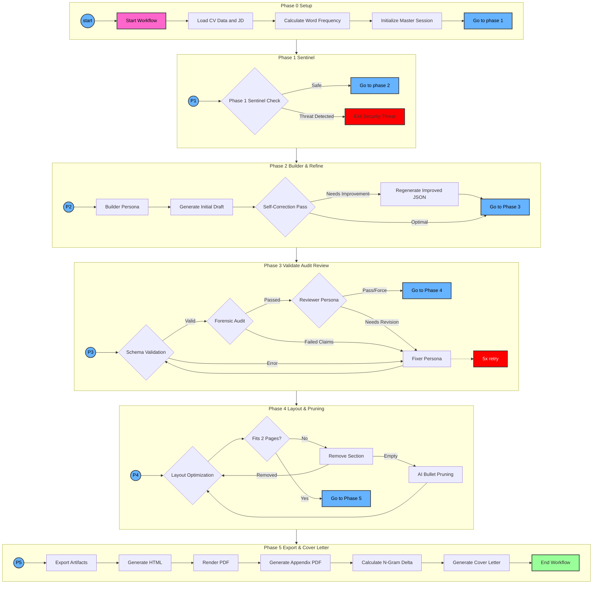

# Project Conventions & Agentic_Tasks Architecture

## Core Mandates
- **Commit Messages:** Use conventional commits (e.g., `fix(orchestrator): handle timeout`).
- **File Preservation:** Do not delete JD or PD files.
- **Paths:** Always use absolute paths or paths relative to the project root when running scripts.

## Agentic_Tasks Architecture

**Trigger:** Activate this skill when the user asks for a task which requires you to modify, fix, or debug any script, persona, data, or file in `Agentic_Tasks/` or the Orchestrator.

### Protocol: Editing Agentic Tasks
If you modify any scripts or logic within the `Agentic_Tasks/` directory:
1.  **Consult Documentation:** Read the "Linkage Map" below to understand dependencies.
2.  **Update Conventions:** If you change how scripts interact (e.g., adding a new phase, changing arguments), you **MUST** update the Mermaid diagram and Linkage Map in this file (`SKILL.md`) to keep the documentation in sync with the code.
3.  **Test:** Run a full orchestrator pass to verify no regressions were introduced.

### Workflow Visualization

## Detailed Phase Documentation

### Entry Point
- **Script:** `Agentic_Tasks/Orchestrator/resume_orchestrator.py`
- **Function:** `run_workflow()` governs the entire pipeline.

### Phase 0: Setup & Initialization
- **Goal:** Prepare the LLM session and data context.
- **Key Files:**
  - `Agentic_Tasks/Orchestrator/utils/context_loader.py`: Recursively reads `cv-data/*.md` and structures it by schema section (Work, Skills, etc.).
  - `Agentic_Tasks/Orchestrator/utils/session_manager.py`: Handles `init_master_session` (loads context once) and `fork_session` (creates lightweight workers for subsequent tasks).
  - **Logic:** Calculates word frequency of the Job Description (JD) to prime the ATS optimization strategy.

### Phase 1: Sentinel
- **Goal:** Detect traps, prompt injections, or "brown M&M" tests in the JD.
- **Persona:** `sentinel_persona.md`
- **Output:** A `SAFE` / `THREAT` verdict and a sanitized JD context. If `THREAT`, the pipeline aborts.

### Phase 2: Builder
- **Goal:** Generate the initial JSON Resume draft.
- **Persona:** `builder_persona.md` ("Executive Resume Writer").
- **Logic:** 
  - Uses the Master Session context (CV + JD).
  - Performs a **Self-Correction Pass** immediately after generation to refine tone and impact.
  - **Constraints:** No markdown in JSON values, strict schema adherence.

### Phase 3: The Refinement Loop (Audit/Fix/Review)
This is the most complex phase, involving a feedback loop (Max 5 retries).

1.  **Schema Validation:**
    -   **Tool:** `Agentic_Tasks/Resume_Audit/validate_schema.py`
    -   **Check:** JSON structure, date formats (YYYY-MM-DD), legacy field presence (`company` vs `name`).
    -   **Action:** If fail -> Invoke `fixer_persona` to repair syntax.

2.  **Forensic Audit:**
    -   **Tool:** `Agentic_Tasks/Resume_Audit/audit_content_new.py`
    -   **Check:** Verifies every claim in the resume against the `cv-data` source of truth using a parallel pool of auditor agents.
    -   **Features:** Checks for "hallucinations" (claims with no evidence) and "regressions" (formatting rules).
    -   **Action:** If fail -> Invoke `fixer_persona` to remove/correct unverified claims.

3.  **Professional Review:**
    -   **Persona:** `reviewer_persona.md` (FAANG Recruiter).
    -   **Check:** Keyword matching, "Impact" analysis, Voice/Tone.
    -   **Action:** 
        -   `PASS`: Move to Phase 4.
        -   `NEEDS_REVISION`: Invoke `fixer_persona` to apply specific impact improvements.

### Phase 4: Layout & Pruning
- **Goal:** Enforce a strict 2-page limit (or user specified) for the PDF.
- **Tool:** `Agentic_Tasks/Maintenance/enforce_page_limit.py`
- **Logic:**
  1.  **Layout Optimization:** Tries adjusting CSS scaling (1.0 -> 0.99) and margins (1.0in -> 0.5in).
  2.  **Section Removal:** If still too long, removes optional sections (Interests, References).
  3.  **AI Pruning:** As a last resort, uses LLM to rewrite/shorten bullet points without losing meaning.

### Phase 5: Export & Final Artifacts
- **Goal:** Generate deliverable files.
- **Tools:**
  -   `resume-cli export`: Generates HTML from JSON using `custom-resume-theme`.
  -   `Agentic_Tasks/Format_Conversion/html_to_pdf.py`: Renders HTML to PDF using Playwright (headless Chrome).
  -   `Agentic_Tasks/Format_Conversion/append_data_to_pdf.py`: Appends the full `cv-data` as an appendix to the PDF.
- **Cover Letter:**
  -   Calculates "N-Gram Delta" (keywords missing from resume but present in JD).
  -   Generates a tailored cover letter using `cover_letter_persona.md`.

## Supporting Directories

- **`Agentic_Tasks/Maintenance/`**:
    -   `lint_cv_data.py`: Checks `cv-data` markdown files for bad frontmatter or banned words (1st person voice).
    -   `fix_metadata.py`: Batch fixes frontmatter.
    -   `update_frontmatter_urls.py`: Scrapes URLs from body text to frontmatter.

- **`Agentic_Tasks/Resume_Audit/`**:
    -   `known_regressions.json`: Definitions for rule-based checks (e.g., "No Markdown in Highlights").
    -   `audit_content_new.py`: The parallelized, session-aware auditing engine.

- **`Agentic_Tasks/Format_Conversion/`**:
        - `json_to_md.py`: Converts JSON resume to Markdown (useful for LLM context injection).
    
    ## Orchestrator Linkage Map
    
    The `resume_orchestrator.py` script acts as the "Master Controller," gluing the system together primarily via `subprocess.run()` calls to independent scripts.
    
    ### 1. The Core: `Agentic_Tasks/Orchestrator/`
    *   **`resume_orchestrator.py`**: The entry point. Manages the lifecycle and personas.
    *   **`utils/context_loader.py`**: **Phase 0**. Recursively scrapes `cv-data/` to build the Master Context.
    *   **`utils/session_manager.py`**: **All Phases**. Manages `~/.gemini/tmp/` sessions, creating the Master Session and forking Worker Sessions for parallel tasks.
    *   **`personas/*.md`**: Loaded into memory and sent to Gemini to "program" the agent for each phase.
    
    ### 2. Validation (Phase 3): `Agentic_Tasks/Resume_Audit/`
    *   **`validate_schema.py`**:
        *   **Called By:** Orchestrator (Phase 3a).
        *   **Mechanism:** `subprocess`.
        *   **Role:** Returns exit code `1` on schema failure, triggering the Fixer persona.
    *   **`audit_content_new.py`**:
        *   **Called By:** Orchestrator (Phase 3b).
        *   **Mechanism:** `subprocess`.
        *   **Role:** The "Forensic Auditor." Spins up its *own* pool of Gemini threads (via `session_manager`) to verify claims against `cv-data`. Reads `known_regressions.json` for rule checks.
    
    ### 3. Formatting & Layout (Phase 4): `Agentic_Tasks/Maintenance/`
    *   **`enforce_page_limit.py`**:
        *   **Called By:** Orchestrator (Phase 4).
        *   **Mechanism:** `subprocess`.
        *   **Role:** The "Layout Engine." Runs a loop: Render PDF -> Count Pages -> Tweak CSS/Prune -> Repeat.
        *   **Dependency:** Calls `html_to_pdf.py` internally to check length.
    
    ### 4. Artifact Generation (Phase 5): `Agentic_Tasks/Format_Conversion/`
    *   **`html_to_pdf.py`**:
        *   **Called By:** Orchestrator (Phase 5) AND `enforce_page_limit.py` (Phase 4).
        *   **Mechanism:** `subprocess`.
        *   **Role:** Renders HTML to PDF using Playwright (Headless Chrome).
    *   **`append_data_to_pdf.py`**:
        *   **Called By:** Orchestrator (Phase 5).
            *   **Mechanism:** `subprocess`.
            *   **Role:** Merges the Resume PDF with the `cv-data` Appendix.
        
        ## Standalone & Maintenance Tools
        
        These scripts exist in `Agentic_Tasks` but are **NOT** part of the `resume_orchestrator.py` pipeline. They are intended for manual use or specific one-off tasks.
        
        - **`Agentic_Tasks/Orchestrator/generate_cover_letter_only.py`**: Generates a cover letter for an existing resume/JD pair without regenerating the resume itself.
        - **`Agentic_Tasks/Orchestrator/generate_interview_prep.py`**: Generates an interview preparation dossier based on the JD and resume.
        - **`Agentic_Tasks/Resume_Audit/fix_resume_structure.py`**: A manual utility to repair broken JSON structure if the orchestrator fails catastrophically.
        - **`Agentic_Tasks/Format_Conversion/json_to_md.py`**: Converts a JSON resume to Markdown format (useful for debugging or feeding back into LLMs manually).
        - **`Agentic_Tasks/Maintenance/*.py`** (except `enforce_page_limit.py`):
            - `lint_cv_data.py`: Run this manually to check `cv-data` quality.
            - `fix_metadata.py`: Batch fix frontmatter issues.
            - `update_frontmatter_urls.py`: Scrape URLs from body text to frontmatter.
        - **`Agentic_Tasks/LinkedIn/*.py`**: Scripts for automating LinkedIn profile updates.
        