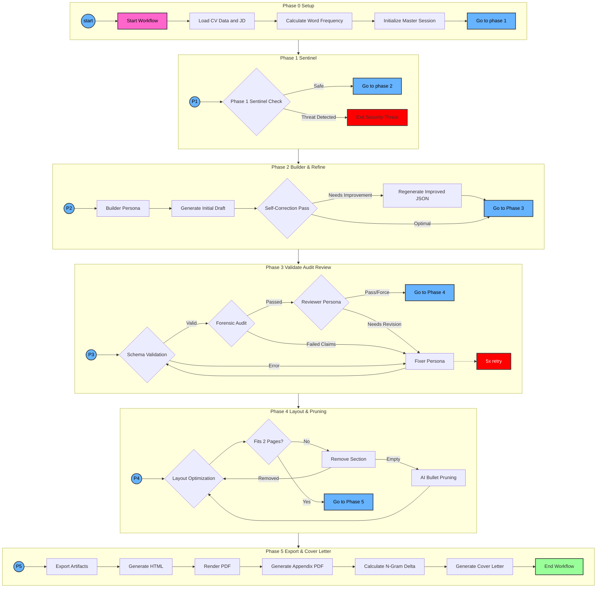

# Resume Writer

> A version-controlled "CV-as-Code" system and career intelligence platform.

The traditional job hunt is built on information asymmetry:
- **The Static Resume Problem:** You try to compress a multi-dimensional career into a static PDF, hoping it matches a recruiter's arbitrary keyword requirements.
- **The Interview Imbalance:** You often walk into an interview at a disadvantage. The interviewer has read your professional history, reviewed your GitHub, and checked your LinkedIn, while you might only know their name and a brief job title.

**Resume Writer** solves this by focusing on three core capabilities:

1. **Build:** Manage a comprehensive "CV-as-Code" markdown database (your professional Life OS) to serve as a single source of truth for your entire career history.
2. **Generate:** Synthesize hyper-tailored, ATS-optimized resumes and cover letters. **Crucially, every generated resume undergoes a rigorous, multi-agent Forensic Content Audit.** The system strictly prevents AI hallucinations by ensuring every single claim mapped to the final resume is verifiably sourced from your markdown database.
3. **OSINT:** Conduct pre-interview open-source intelligence on the company, position, and interviewer to level the playing field before your first conversation.

## 🚀 Quick Start

### Setup Instructions

To get started, install the Gemini CLI and have it help you build your CV from resumes, articles, clubs, github repositories, and more. 

Have the agent run `setup.sh` to get dependencies pulled:

```bash
./setup.sh
```

## 🛠 Usage

This ENTIRE repository is fundamentally designed as a conversational "vibe-resume" system. You ask the Gemini CLI for what you need. 

Here are examples of how to interact with the system:

> **Please take this resume and expand it into positions, skills, projects, and general information.**<br>
`Gemini will break down the data and create several Markdown files in the appropriate cv-data directories for you.`

> **I just got my year-end-review. Please extract meaningful information from it.**<br>
`Gemini will create impact statements and adjust your position documentation.`

> **I'd like to work on adding some numbers and statistics to my various experience claims. What do you recommend?**<br>
`Gemini will analyze your data and help you find items which are appropriate to have numbers, percentages, and measurements.`

> **I have a list of github projects here. Can you pull them down and review, then add to my projects? <url> <url> <url>**<br>
`Gemini will clone the projects, give an article-style review of each, and add them to your projects folder.`

> **Please analyze this link and create a new news mentions article: https://www.pcworld.com/article/482558/hummingbird_brings_your_bricked_phone_back_to_life.html**<br>
`Gemini will visit the link and create a formatted media mentions article.`

> **\<Copy and paste position description\>**<br>
`Gemini will trigger the pipeline to generate a 100% accurate, tailored resume based on the position description n-grams and your experience.`

> **We created a resume last week and now I have an interview with Karen at MegaCorp in 20 minutes. Please help me with intelligence.**<br>
`Gemini will look at the position description, find information about the interviewer, cross-reference your CV, and provide talking points, questions, emphases, and things you might have in common.`

For detailed technical instructions on the AI workflow, see [**.gemini/GEMINI.md**](.gemini/GEMINI.md).

## Resume Orchestration Workflow

This document describes the multi-agent orchestration process used to generate ATS-optimized resumes and cover letters.

### Workflow Diagram



### Phase Descriptions

#### Phase 0: Setup
- **Load Context**: Gathers CV data from `cv-data/` and the target Job Description (JD).
- **Word Frequency**: Analyzes the JD to identify high-priority ATS keywords.
- **Master Session**: Initializes a core LLM session with the full context to be used as a template for specialized agents.

#### Phase 1: Sentinel
- **Sentinel Check**: Scans the JD for security prompts, "jailbreaks," or hidden instructions that might compromise the agent.

#### Phase 2: Builder
- **Drafting**: The Builder persona selects the most relevant history and synthesizes the first JSON resume draft.

#### Phase 3: Validation, Audit & Review
- **Schema Validation**: Ensures the JSON complies with the standard schema.
- **Forensic Audit**: Fact-checks every claim in the resume against the source CV data.
- **Reviewer Persona**: Evaluates the resume for strategy, tone, and JD alignment.
- **Fixer Persona**: Iteratively repairs schema errors, factual hallucinations, and quality gaps.

#### Phase 4: Polish & Cover Letter
- **Stage 1: Length Enforcement**:
  1. **Layout Optimization**: Adjusts CSS margins and scaling first.
  2. **Section Removal**: Progressively removes low-priority sections (Interests, Languages) if needed.
  3. **AI Bullet Pruning**: Uses a specialized **Resume Editor AI** to intelligently shorten bullet points as a last resort.
- **Stage 2: Final Keyword Check**: Re-scans the *pruned* resume to identify any ATS keywords that were lost or missing.
- **Stage 3: Cover Letter Generation**: Drafts a narrative cover letter, specifically addressing the gaps identified in Stage 2.

#### Phase 5: Export
- **Export Artifacts**: Converts the validated JSON into HTML and polished PDF formats, including a version with a full-data appendix.

## 📂 Repository Structure

- **`cv-data/`**: (Submodule/Private) The "Source of Truth." Contains categorized Markdown files describing professional history, projects, and skills.
- **`incoming/`**: Workspace for parsing and processing new files before they are integrated into the database.
- **`Agentic_Tasks/`**: Tooling for auditing resumes, converting formats (HTML to PDF), and maintenance.
- **`cv-data/resumes/`**: The output directory for generated JSON, HTML, and PDF resumes.
  - **`archive/`**: Historic resume storage - a place to keep inactive items.
- **`.gemini/`**: Configuration and the technical **Agentic Workflow** (`GEMINI.md`).